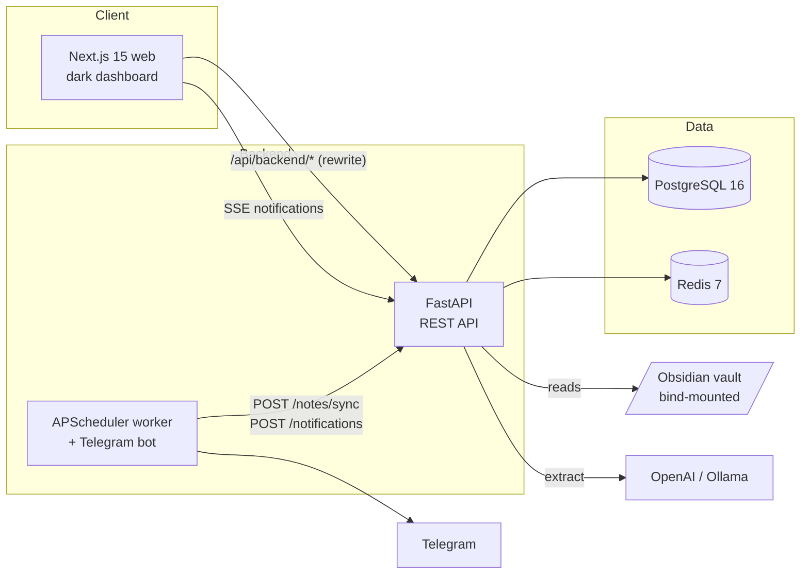

# AI Planner

> A self-hosted, AI-first personal productivity OS — it reads your notes,
> turns them into actionable tasks, prioritizes your day, and gently keeps
> you out of procrastination.

AI Planner aggregates your notes, deadlines and ideas from an Obsidian
vault, extracts structured tasks and events with an LLM, scores them with a
transparent prioritization engine, builds a realistic day plan, and reminds
you through Telegram and desktop notifications — all behind a fast,
dark-first dashboard.

---

## Table of contents

- [Features](#features)
- [Architecture](#architecture)
- [Tech stack](#tech-stack)
- [Repository layout](#repository-layout)
- [Quick start](#quick-start)
- [Configuration](#configuration)
- [API overview](#api-overview)
- [Local development](#local-development)
- [Testing](#testing)
- [Make targets](#make-targets)
- [Roadmap](#roadmap)

---

## Features

| Area | What it does |
|------|--------------|
| **Task manager** | Full CRUD, statuses (`inbox / planned / active / done / archived / snoozed`), projects, subtasks, tags, due dates, effort & duration estimates. |
| **Prioritization engine** | Transparent weighted score — `urgency·0.35 + importance·0.30 + effort⁻¹·0.10 + strategic·0.10 + procrastination·0.15` — mapped to `P0…P4` buckets. |
| **Eisenhower matrix** | A 2×2 board (Do First / Schedule / Delegate / Eliminate). Tasks auto-place by urgency × importance; drag a card to another quadrant to rewrite its scores. |
| **Notes ingestion** | Scans an Obsidian vault (or any Markdown folder), parses front-matter, headings, checkboxes, `#tags`, `[[wikilinks]]` and inline dates. Idempotent, checksum-based sync. |
| **AI extraction** | A pluggable LLM layer (OpenAI / Ollama / heuristic fallback) turns raw note text into structured entities with confidence scores. Heuristic drafts are always available offline. |
| **Day scheduler** | Greedy planner packs open tasks into work-hour blocks by priority, flags overflow, and writes a timeline you can review on the calendar. |
| **Reminders** | Telegram bot (`/today`, `/tasks`, `/focus`, …) and desktop notifications over Server-Sent Events. A worker dispatches due reminders every minute. |
| **Learning planner** | Learning goals broken into sessions with spaced-repetition review scheduling. |
| **Anti-procrastination** | A per-task procrastination score (snooze count + age) surfaces stuck tasks and offers AI-driven decomposition into micro-steps. |
| **Analytics** | Completion trends, overdue history and productivity charts. |

---

## Architecture

AI Planner is a Docker Compose monorepo of three runtime services plus
PostgreSQL and Redis.



### Components

- **`apps/web`** — Next.js 15 (App Router, React 19, TypeScript strict).
  A dark-first dashboard with TanStack Query for server state, Framer
  Motion for animation, and Recharts for analytics. The browser never
  talks to the API directly: Next.js rewrites `/api/backend/*` to the
  FastAPI service, which keeps CORS trivial and the API host private.

- **`apps/api`** — FastAPI on Python 3.12 with async SQLAlchemy 2 and
  Alembic. Organized in layers: **routers** (`app/api/v1`) →
  **services** (domain logic) → **repositories** (data access) →
  **models** (ORM). Pydantic v2 schemas isolate the wire format from the
  ORM. A single dependency wraps every request in one transaction.

- **`apps/worker`** — an APScheduler loop that runs background jobs
  (vault sync, reminder dispatch, heartbeat) and hosts the Telegram bot.
  The worker never touches the database directly for ingestion — it
  calls the API, keeping a single source of truth for business logic.

- **`packages/*`** — shared TypeScript workspace packages (`types`,
  `config`, `ui`) for cross-app contracts.

### Data flow

```
Obsidian vault  ──►  Markdown parser  ──►  heuristic candidates
                                               │
                                               ▼
                                       AI extraction (optional)
                                               │
                                               ▼
                              ExtractedEntity rows  ──►  Notes Inbox
                                               │  accept
                                               ▼
                                            Task  ──►  Prioritization
                                               │
                                               ▼
                                       Day scheduler  ──►  Timeline
                                               │
                                               ▼
                                    Reminders  ──►  Telegram / desktop
```

1. The worker (or a manual trigger) calls `POST /notes/sync`.
2. The ingest pipeline walks the vault, upserts `NoteDocument` rows by
   SHA-256 checksum, and extracts candidate entities.
3. If an AI provider is configured, the heuristic drafts are sent to the
   LLM as hints; it re-ranks and enriches them. Otherwise the heuristic
   output stands on its own.
4. Candidates land in the **Notes Inbox**; accepting one promotes it to a
   real `Task`.
5. The prioritization engine scores every task; the scheduler packs them
   into the day; the reminder dispatcher delivers notifications.

### AI provider abstraction

The LLM is never a hard dependency. `app/services/ai/provider.py` defines
an `AIProvider` interface with three implementations:

- **OpenAI** — JSON-mode chat completions with a strict extraction schema.
- **Ollama** — a local model (default `qwen2.5:7b`) for fully offline use.
- **Null** — a no-op fallback; ingestion still works via the heuristic
  Markdown parser.

`get_provider()` picks one from configuration, so the rest of the app is
provider-agnostic.

---

## Tech stack

**Frontend** — Next.js 15 · React 19 · TypeScript · Tailwind CSS ·
shadcn-style UI · Framer Motion · Recharts · TanStack Query · Zustand

**Backend** — Python 3.12 · FastAPI · SQLAlchemy 2 (async) · Alembic ·
Pydantic v2 · structlog · APScheduler · aiogram

**Data & infra** — PostgreSQL 16 · Redis 7 · Docker Compose ·
GitHub Actions CI

**AI** — OpenAI API · Ollama (local LLM) · structured JSON extraction

---

## Repository layout

```
neuroplan/
├── apps/
│   ├── api/            FastAPI backend
│   │   ├── app/
│   │   │   ├── api/v1/       Routers (tasks, notes, schedule, learning, …)
│   │   │   ├── services/     Domain logic (prioritization, scheduler, ai/)
│   │   │   ├── repositories/ Data-access layer
│   │   │   ├── models/       SQLAlchemy ORM models
│   │   │   ├── schemas/      Pydantic request/response models
│   │   │   └── core/         Config & logging
│   │   ├── alembic/         Database migrations
│   │   └── tests/           pytest suite
│   ├── web/            Next.js dashboard
│   │   ├── app/            App Router pages
│   │   ├── components/     UI, shell, feature components
│   │   └── lib/            Typed API client
│   └── worker/         APScheduler jobs + Telegram bot
├── packages/           Shared TS workspace packages
├── infra/docker/       docker-compose.yml
├── docs/               Per-phase changelogs
└── Makefile            Dev shortcuts
```

---

## Quick start

**Prerequisites:** Docker Desktop (Compose v2).

```bash
git clone https://github.com/Totsamuychel/AI-Planner.git
cd AI-Planner/neuroplan
cp .env.example .env   # then edit .env — see Configuration below
make up                # build + start all services
```

Once the stack is healthy:

| Service | URL |
|---------|-----|
| Web dashboard | http://localhost:3000 |
| API | http://localhost:8000 |
| API docs (Swagger) | http://localhost:8000/docs |
| Health check | http://localhost:8000/api/v1/health |

Seed demo data (optional):

```bash
docker compose -f infra/docker/docker-compose.yml exec api python -m scripts.seed
```

Stop everything with `make down`.

---

## Configuration

All settings live in `.env` (copy from `.env.example`).

### Obsidian vault

Point `OBSIDIAN_VAULT_HOST` at your real vault on the host — it is
bind-mounted **read-only** into the API container at `/data/vault`:

```env
OBSIDIAN_VAULT_HOST=C:\Users\you\Documents\MyVault
```

Then add a note source in the **Notes Inbox** page (path `/data/vault`)
and press **Sync vault now**. Leave the variable empty to use an
in-container placeholder folder.

### AI provider

```env
# OpenAI
AI_PROVIDER=openai
OPENAI_API_KEY=sk-...
AI_MODEL=gpt-4o-mini

# or a local Ollama model
AI_PROVIDER=ollama
OLLAMA_BASE_URL=http://ollama:11434
OLLAMA_MODEL=qwen2.5:7b
```

With no key set, ingestion falls back to the offline heuristic parser.

**Running Ollama locally.** The `ollama` service sits behind a Compose
profile so its multi-gigabyte image is not pulled by default:

```bash
docker compose -f infra/docker/docker-compose.yml --profile ollama up -d
docker compose -f infra/docker/docker-compose.yml exec ollama ollama pull qwen2.5:7b
```

Then set `AI_PROVIDER=ollama` in `.env` and restart the API.

### Telegram (optional)

```env
TELEGRAM_BOT_TOKEN=123456:ABC-...
```

Set your chat ID in the **Settings** page to receive reminders.

---

## API overview

All endpoints are under `/api/v1`.

| Group | Endpoints |
|-------|-----------|
| Tasks | `GET/POST /tasks`, `GET/PATCH/DELETE /tasks/{id}`, `/complete`, `/snooze`, `/decompose`, `/scores`, `/reprioritize` |
| Projects | `GET/POST /projects`, `PATCH/DELETE /projects/{id}` |
| Notes | `/notes/sources`, `/notes/sync`, `/notes/documents`, `/notes/inbox`, `/notes/inbox/{id}/accept` |
| Schedule | `/schedule/today`, `/schedule/generate`, `/schedule/rebalance` |
| Learning | `/learning/goals`, `/learning/goals/{id}/sessions`, `/learning/review` |
| Notifications | `/notifications/sse`, `/notifications/test`, `/notifications/history` |
| Analytics | `/analytics/dashboard` |

Interactive docs: http://localhost:8000/docs

---

## Local development

Run services outside Docker for faster iteration:

```bash
# Backend
cd apps/api
python -m venv .venv && source .venv/bin/activate   # Windows: .venv\Scripts\activate
pip install -e .[dev]
uvicorn app.main:app --reload

# Frontend
cd apps/web
pnpm install
pnpm dev
```

PostgreSQL and Redis can still come from Docker (`make up`, then stop the
`api`/`web` containers).

---

## Testing

```bash
make test            # backend pytest suite inside the container
```

The suite covers the prioritization engine, the Markdown parser, the
day scheduler, the AI provider abstraction and the API health checks.

---

## Make targets

| Target | Action |
|--------|--------|
| `make up` | Build and start all services |
| `make down` | Stop services |
| `make logs` | Tail logs |
| `make migrate` | Run Alembic migrations |
| `make test` | Run the backend test suite |
| `make lint` | Ruff + mypy + ESLint |
| `make fmt` | Ruff format + Prettier |
| `make api-sh` | Shell into the API container |

---

## Roadmap

The project was built in phases; per-phase changelogs live in [`docs/`](docs/).

- [x] **Phase 0** — Monorepo bootstrap & infrastructure
- [x] **Phase 1** — Core task manager & prioritization
- [x] **Phase 2** — Notes ingestion (Obsidian / Markdown)
- [x] **Phase 3** — AI extraction
- [x] **Phase 4** — Day scheduling
- [x] **Phase 5** — Telegram & desktop notifications
- [x] **Phase 6** — Learning planner
- [x] **Phase 7** — Anti-procrastination engine
- [x] **Phase 8** — Polish & analytics
- [x] Eisenhower matrix · real Obsidian vault sync

---

<sub>Built as a production-like reference project. Technical identifiers
(package names, the Docker project, the database) keep the internal
codename <code>neuroplan</code>.</sub>
